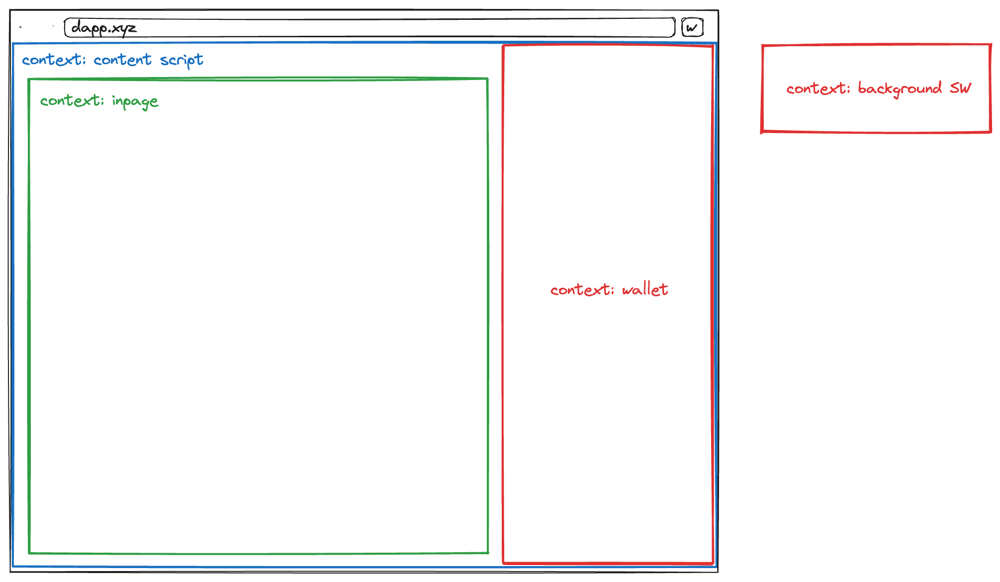
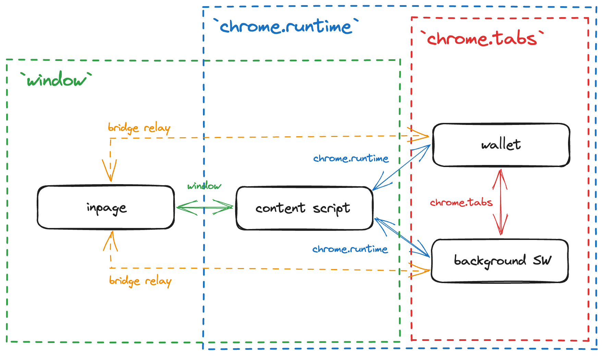

# Contributing

Thanks for your interest in contributing to Dev Wallet! Please take a moment to review this document **before submitting a pull request.**

If you want to contribute, but aren't sure where to start, you can create a [new discussion](https://github.com/wagmi-dev/wallet/discussions).

> **Note**
>
> **Please ask first before starting work on any significant new features.**
>
> It's never a fun experience to have your pull request declined after investing time and effort into a new feature. To avoid this from happening, we request that contributors create a [feature request](https://github.com/wagmi-dev/wallet/discussions/new?category=ideas) to first discuss any API changes or significant new ideas.

<br>

## Overview of the Web Extension

Here is a [great primer](https://developer.chrome.com/docs/extensions/mv3/getstarted/extensions-101/) on Web Extensions. The rest of the [Chrome Developers guides](https://developer.chrome.com/docs/extensions/mv3/) are pretty good too.

### Contexts

The Dev Wallet has four isolated contexts:

- **Wallet** app:
  - A Single Page Application (SPA).
  - The main UI of the Dev Wallet (a React app). 
  - It is exposed to the global [Web Extension APIs](https://developer.chrome.com/docs/extensions/reference/) (ie. `chrome.runtime`).
- **Background** service worker: 
  - A service worker that runs in isolation in the background. The **Background** context is responsible for: handling RPC requests, external network requests, initializing the extension context menu, registering content scripts, etc. 
  - It is also exposed to the global [Web Extension APIs](https://developer.chrome.com/docs/extensions/reference/) (ie. `chrome.runtime`).
- **Content Script**: 
  - Executes JavaScript in the context of the current webpage. The **Content Script** context is mainly responsible for injecting the **Wallet** app into the current webpage. 
  - It is exposed to **only a subset** of the global [Web Extension APIs](https://developer.chrome.com/docs/extensions/reference/) (ie. `chrome.runtime`). 
  - Its [`window` instance](https://developer.mozilla.org/en-US/docs/Web/API/Window) is **not the same** as the current webpage's `window` instance.
- **Inpage**:
  - Similar to the **Content Script** and executes JavaScript in the context of the current webpage. The **Inpage** context is mainly responsible for injecting the `window.ethereum` provider into the current webpage.
  - Unlike the Content Script, it is **not** exposed to the global [Web Extension APIs](https://developer.chrome.com/docs/extensions/reference/) (ie. `chrome.runtime`).
  - Its [`window` instance](https://developer.mozilla.org/en-US/docs/Web/API/Window) is the same as the current webpage's `window` instance.

Below is a diagram which visualizes these four contexts.

<picture>
  <source media="(prefers-color-scheme: dark)" srcset="./assets/interface-diagram-dark.png">
  <source media="(prefers-color-scheme: light)" srcset="./assets/interface-diagram-light.png">
  
</picture>

#### Cross-context Messaging

We can utilize a combination of the [`chrome.runtime.sendMessage`/`chrome.tabs.sendMessage` APIs](https://developer.chrome.com/docs/extensions/mv3/messaging/) and [`window.postMessage` API](https://developer.mozilla.org/en-US/docs/Web/API/Window/postMessage) to communicate between contexts. 

<picture>
  <source media="(prefers-color-scheme: dark)" srcset="./assets/messaging-dark.png">
  <source media="(prefers-color-scheme: light)" srcset="./assets/messaging-light.png">
  
</picture>

It is important to note that the **Inpage** context does not have access to Web Extension APIs, and the **Background**/**Wallet** contexts do not have access to the `window` instance, which makes messaging between these contexts non-trivial. To make this possible, we need to set up a "bridge relay" in the **Content Script** context which has access to `window` and the Web Extension APIs.

To make this communication easier, we have created a ["Messenger" abstraction](../src/messengers/getMessenger.ts) so you don't have to think about what transport (`window.postMessage` vs. `chrome.runtime.sendMessage` vs. `chrome.tabs.sendMessage`) to use, setting up a bridge relay, and dealing their synchronous nature.

##### Example

`example.ts` (**Wallet** context)

```tsx
import { getMessenger } from '~/messengers';

const messenger = getMessenger({ connection: 'background <> wallet' });

async function example() {
  const result = await messenger.send('ping', { foo: 'bar' });
  console.log(result); // "pong and bar"
}
```

`background.ts` (**Background** context)

```tsx
import { getMessenger } from '~/messengers';

const messenger = getMessenger({ connection: 'background <> wallet' });

messenger.reply('ping', (args) => {
  return `pong and ${args.foo}`;
});
```

## Getting Started

This guide is intended to help you get started with contributing. By following these steps, you will understand the development process and workflow.

1. [Cloning the repository](#cloning-the-repository)
2. [Installing Node.js and pnpm](#installing-nodejs-and-pnpm)
3. [Installing Foundry](#installing-foundry)
4. [Installing dependencies](#installing-dependencies)
5. [Running the Web Extension](#running-the-web-extension)
6. [Installing the Web Extension](#installing-the-web-extension)
7. [Submitting a pull request](#submitting-a-pull-request)
8. [Versioning](#versioning)

<br>

---

<br>

### Cloning the repository

To start contributing to the project, clone it to your local machine using git:

```bash
git clone https://github.com/wagmi-dev/wallet.git --recurse-submodules
```

Or the [GitHub CLI](https://cli.github.com):

```bash
gh repo clone wagmi-dev/wallet -- --recurse-submodules
```

<div align="right">
  <a href="#basic-guide">&uarr; back to top</a></b>
</div>

### Installing Node.js and pnpm

The Dev Wallet uses [pnpm](https://pnpm.io/workspaces). You need to install **Node.js v18 or higher** and **pnpm v8 or higher**.

You can run the following commands in your terminal to check your local Node.js and pnpm versions:

```bash
node -v
pnpm -v
```

If the versions are not correct or you don't have Node.js or pnpm installed, download and follow their setup instructions:

- Install Node.js using [fnm](https://github.com/Schniz/fnm) or from the [official website](https://nodejs.org)
- Install [pnpm](https://pnpm.io/installation)

<div align="right">
  <a href="#basic-guide">&uarr; back to top</a></b>
</div>

### Installing Anvil

The Dev Wallet uses [Anvil](https://book.getfoundry.sh/anvil/) to spin up a forked Ethereum node.

Install Anvil using the following command:

```bash
curl -L https://foundry.paradigm.xyz | bash
```

### Installing dependencies

Once in the project's root directory, run the following command to install the project's dependencies:

```bash
pnpm install
```

<div align="right">
  <a href="#basic-guide">&uarr; back to top</a></b>
</div>

### Running the Web Extension

After you have installed dependencies, you are ready to run the Web Extension. To do so, run the following command:

```bash
pnpm dev
```

This will run a script that will build the Web Extension and start a dev server for the Test Dapp, it will also open the Test Dapp in a new browser tab. The Web Extension also utilizes Hot Module Replacement (HMR), so you can make changes to the code and see them reflected in the extension without having to reload the extension itself.

<div align="right">
  <a href="#basic-guide">&uarr; back to top</a></b>
</div>

### Installing the Web Extension

Once you have your dev server running, you can install the Web Extension in your browser. To do so, follow these steps:

1. Open your browser's Extensions page
2. Enable "Developer mode" in the top right corner
3. Click "Load unpacked" in the top left corner
4. Select the `dist/dev` folder in the Dev Wallet's root directory
5. You're good to go! Don't forget to pin the Extension to your browser's toolbar for easy access. 🎉

### Submitting a pull request

When you're ready to submit a pull request, you can follow these naming conventions:

- Pull request titles use the [Imperative Mood](https://en.wikipedia.org/wiki/Imperative_mood) (e.g., `Add something`, `Fix something`).
- [Changesets](#versioning) use past tense verbs (e.g., `Added something`, `Fixed something`).

When you submit a pull request, GitHub will automatically lint, build, and test your changes. If you see an ❌, it's most likely a bug in your code. Please, inspect the logs through the GitHub UI to find the cause.

<div align="right">
  <a href="#basic-guide">&uarr; back to top</a></b>
</div>

<br>
<br>

<div>
  ✅ Now you're ready to contribute to the Dev Wallet!
</div>

<div align="right">
  <a href="#advanced-guide">&uarr; back to top</a></b>
</div>
